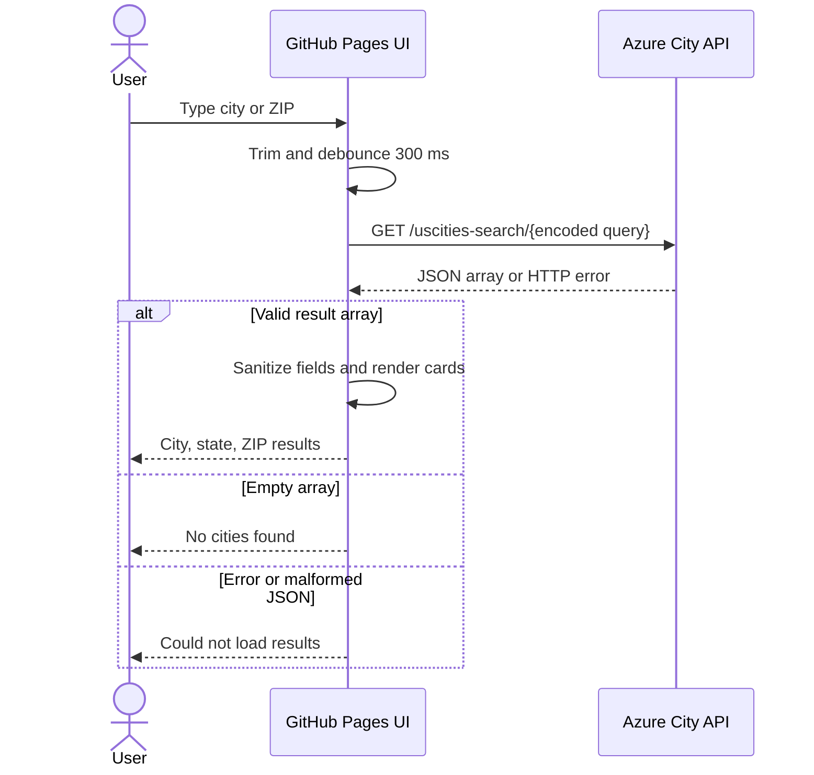

# USCities Search — Task 2 Report

## Introduction

USCities Search is a static front end for the City Search REST microservice. A user can search by city name or ZIP code and receive matching cities, states, and ZIP codes without leaving the page.

Live application: **https://sammcoww.github.io/uscities-search/**

Microservice used by the front end: `https://sammcoww-uscities-microservices-cqedf7g6g5azgtd5.canadacentral-01.azurewebsites.net`

## Analysis

### Use case

**Name:** Search for a US city  
**Actor:** Visitor  
**Precondition:** The browser can reach the GitHub Pages site and Azure API.  
**Main flow:**

1. The visitor enters a city name or ZIP code.
2. The application waits until at least two characters are entered, then sends a debounced request.
3. The API returns JSON city records.
4. The application validates the JSON array and displays the city, state, and ZIP values.

**Alternative flows:** An empty query is ignored, no matches produce “No cities found,” and an HTTP, network, or malformed-response error produces a safe error message.

### User stories

- As a visitor, I want to search by city name so that I can find matching US cities.
- As a visitor, I want to search by ZIP code so that I can identify the associated city.
- As a visitor, I want results to update while I type so that I get immediate feedback.
- As a visitor, I want a clear no-results or error message so that the interface never appears broken.

### Acceptance criteria

| ID | Criterion | Implementation |
|---|---|---|
| AC1 | City-name results are displayed. | `search()` calls the API and `json2htmllist()` renders records. |
| AC2 | ZIP-code results are displayed. | The query is URL-encoded and sent to `/uscities-search/{query}`. |
| AC3 | Empty results are clear. | The UI displays `No cities found`. |
| AC4 | API failures are handled. | Non-2xx, network, and malformed responses show an error message. |
| AC5 | Very short live queries do not call the API. | Suggestions begin at two characters. |
| AC6 | Explicit search is supported. | Search button and Enter trigger a search. |
| AC7 | Requests are debounced. | Live searches wait 300 ms after the last keystroke. |
| AC8 | User input is safely rendered. | Displayed fields pass through DOMPurify. |
| AC9 | Whitespace-only input is ignored. | `trim()` runs before `fetch()`. |
| AC10 | JSON shape is checked. | Only arrays are passed to the renderer. |
| AC11 | JSON values are readable. | String, numeric, and array ZIP values are formatted for display. |

## Design

The front end is intentionally a static client: HTML provides the page, CSS provides presentation, and JavaScript owns input handling, API requests, validation, and rendering. The browser calls the existing Azure microservice directly; no second backend or build system is needed.

### Sequence diagram



## Implementation

### Software artifacts

- `index.html` — accessible search input, button, results container, and CDN dependencies.
- `client.js` — API integration, URL encoding, explicit/live search handling, debounce, JSON validation, sanitization, and rendering.
- `styles.css` — button, result-list, and city-card presentation.
- `.github/workflows/static.yml` — GitHub Pages deployment workflow.
- `README.md` — this SSDLC report and run/deployment documentation.

### JSON handling

`fetch()` checks `response.ok` before parsing JSON. The response must be an array; otherwise it is rejected. Each record renders `city`, `state_name`, and `zips`. Values are converted safely so both string ZIP fields and array ZIP fields remain visible. DOMPurify sanitizes values before they are inserted into the result list.

### Live and explicit requests

The input listener clears an existing timer on every keystroke, ignores queries shorter than two characters, and waits 300 ms before calling the API. The Search button and Enter key provide explicit search. Empty and whitespace-only queries return before `fetch()`, avoiding unnecessary requests.

## DevOps and CI/CD

The repository is configured for GitHub Pages using GitHub Actions. A push to `main` or a manual workflow dispatch runs `.github/workflows/static.yml`:

1. `actions/checkout@v4` checks out the repository.
2. `actions/configure-pages@v5` prepares Pages metadata.
3. `actions/upload-pages-artifact@v3` packages the static site.
4. `actions/deploy-pages@v5` publishes it to the `github-pages` environment.

The workflow grants only the Pages deployment permissions required by the job (`contents: read`, `pages: write`, and `id-token: write`). The deployment URL is exposed by the Pages environment and is also recorded above for submission.

## Verification

The JavaScript was checked with:

```powershell
node --check client.js
```

Manual browser checks cover city lookup, ZIP lookup, live search after two characters, Enter/button search, empty input, no matches, API failure, and display of multiple ZIP values. The GitHub Actions workflow provides the deployment check; the live URL above provides the final integration check.

## SSDLC summary

Analysis produced the use case, stories, and acceptance criteria. Design defined a browser-to-microservice sequence and a deliberately small static architecture. Implementation delivered the HTML/CSS/JavaScript artifacts and defensive JSON rendering. DevOps automated publishing through GitHub Actions, completing the path from a change on `main` to the live GitHub Pages application.
